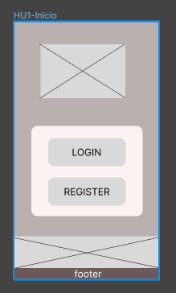
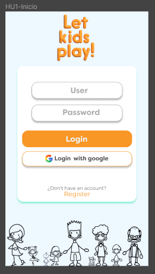

# SN-13 Let Kids Play

[Link al Proyecto](https://katk4tkat.github.io/DEV006-social-network/src/index.html)

Somos una red que busca generar tejidos sociales de cuidado y apoyo colectivos entre personas que están a cargo de niñes. 

### Definir el problema:
Al momento de tener bebés, se genera un aislamiento natural entre quienes pasan a ser cuidadores activos de estos niños y su entorno. Esto ocurre principalmente durante la primera infancia (0-3 años). 

La carga del cuidado se vive de manera muy individual, por lo que se vuelve necesario generar espacios donde les cuidadores puedan comunicarse y compartir con sus pares para poder desarrollarse en comunidad. 

### Solución: 
La idea es generar un espacio digital, donde se puedan proponer espacios de encuentro y colaboración, para evitar el aislamiento que ocurre entre quienes pasan a ser cuidadores. 

### Público objetivo: 
Madres, padres, abuelos, cuidadores en general de niñes en la primera infancia, que tengan acceso a tecnología.## Historias de Usuario (HU)

Basándonos en diferentes historias de usuario, hemos creado un sitio dinámico para asegurarnos de que todos sus requerimientos sean satisfechos. 

## 2. Historias de Usuario 

### HU 1

“Yo como usuario cuidador de niñes, quiero registrarme en LKP con un correo electrónico, nombre de usuario y contraseña para pertenecer a la Red Social.”

#### Criterios de aceptación
El usuario puede registrarse usando cuenta de correo electrónico y contraseña.
No permitir correos o contraseñas inválidas.
Ser responsive y test unitarios.

### HU 2

“Yo como usuario de LKP quiero registrarme con Google en la app para ingresar a la Red Social.”

#### Criterios de aceptación: 
En el home de la aplicación el usuario puede registrarse haciendo click en el logo de Google, dirigiéndose al “muro".

### HU 3

“Yo como usuario de LKP quiero iniciar sesión para ingresar a la página.”

#### Criterios de aceptación: 

El usuario, ya registrado, puede iniciar sesión mediante un correo electrónico y contraseña, dirigiéndose al “muro”.
De ser una contraseña inválida se informará con un mensaje rojo.

### HU 4

“Yo como usuario de LKP quiero iniciar sesión con Google en la app para ingresar a la Red Social.”

#### Criterios de aceptación: 
En el home de la aplicación el usuario puede registrarse haciendo click en el logo de Google, dirigiéndose al “muro".

### HU 5

“Yo como usuario de LKP quiero crear y publicar contenido para aportar a la comunidad.”

#### Criterios de aceptación:
Crear la vista de wall
Crear firestore
A través del menú el usuario puede crear y publicar contenido que se subirá al “muro” de la aplicación.

### HU 6

“Yo como usuario de LKP quiero editar el contenido que publique en la página para poder confirmar lo publicado.”

#### Criterios de aceptación: 
El usuario mediante un botón puede acceder a editar la publicación, para volver a publicarla.

### HU 6

“Yo como usuario de LKP quiero un botón de eliminar en las publicaciones para poder borrar contenido que divulgue.”

#### Criterios de aceptación: 
El usuario mediante el botón de editar contenido puede optar por eliminar su publicación y guardar los cambios.

## 3. Diseño

El sitio fue pensado para personas a cargo del cuidado de niñes, que necesitan una aplicación fácil de utilizar. Bajo esta premisa y siempre pensando en les usuaries, hemos diseñado un sitio web intuitivo que no está sobrecargado de información.

Los botones de navegación son fáciles de detectar en el medio de nuestro sitio web. La paleta de colores está pensada en tonalidad pastel, asociadas normalmente a la infancia.  Hemos personalizado el diseño para cumplir con los requisitos de nuestros usuarios.

El sitio fue diseñado bajo la mentalidad de mobile first.

### PROTOTIPOS 
Para diseñar nuestra aplicación fue necesaria la creación de prototipos. Para esto hicimos primero uno de baja calidad, que nos permitió entender cuáles eran las vistas y elementos necesarios para que la aplicación funcionara de manera correcta. El siguiente paso fue diseñar un prototipo de alta calidad, que fue testeado por usuarios, donde elegimos nuestra paleta de colores, tipos de botones (buscando la intuitividad), tamaño de letras, entre otros elementos relevantes para le usuarie. 

### Prototipo de baja calidad (LQ)

Este es nuestro prototipo de baja  en  [Figma](https://www.figma.com/file/ucwum3SrNhxrcyki3915Ky/SN--13?type=design&node-id=0%3A1&t=4eSYLk0k9PJqPGGo-1)

### Prototipo de alta calidad (HQ)

Este es nuestro prototipo de alta en  [Figma](https://www.figma.com/proto/ucwum3SrNhxrcyki3915Ky/SN--13?type=design&node-id=81-46&scaling=min-zoom&page-id=82%3A4&starting-point-node-id=81%3A46)

### TEST DE USABILIDAD

Estos son los resultados de nuestro test de usabilidad realizado a 6 personas. [Test de Usabilidad app LKP!](https://docs.google.com/spreadsheets/d/1DtMQLvV-D1QTsDhatGhz6OLxq3cdxr-5-5TS5Tdr7k0/edit?usp=sharing)

Conclusiones:La paleta de color utilizada fue del gusto de les usuaries. Las vistas y botones les parecieron adecuadas y la aplicación les pareció de fácil acceso.  Mejoramos el color utilizado en la barra de inicio y footer según lo comentado por les usuaries utilizando un color más amigable según nuestra paleta de colores, incorporamos una descripción de la aplicación creando una nueva vista a modo de ingreso a la app.

## 4. Resultado

